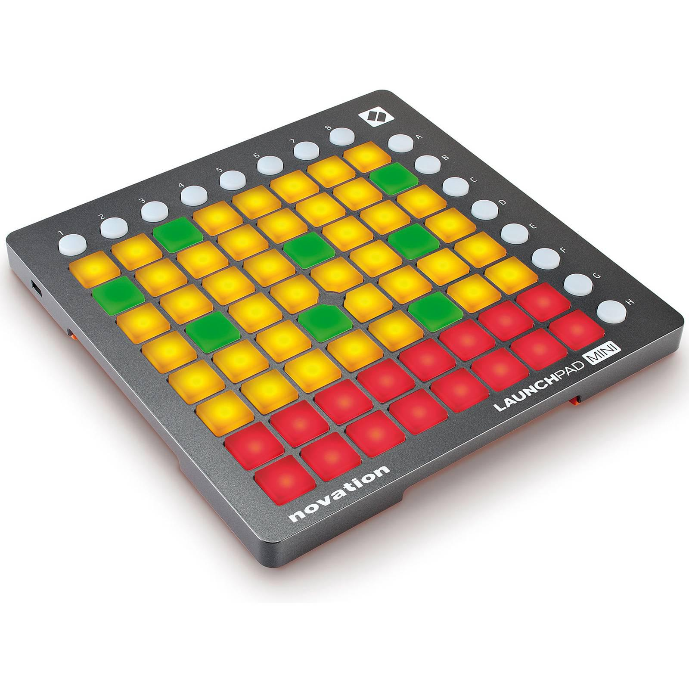
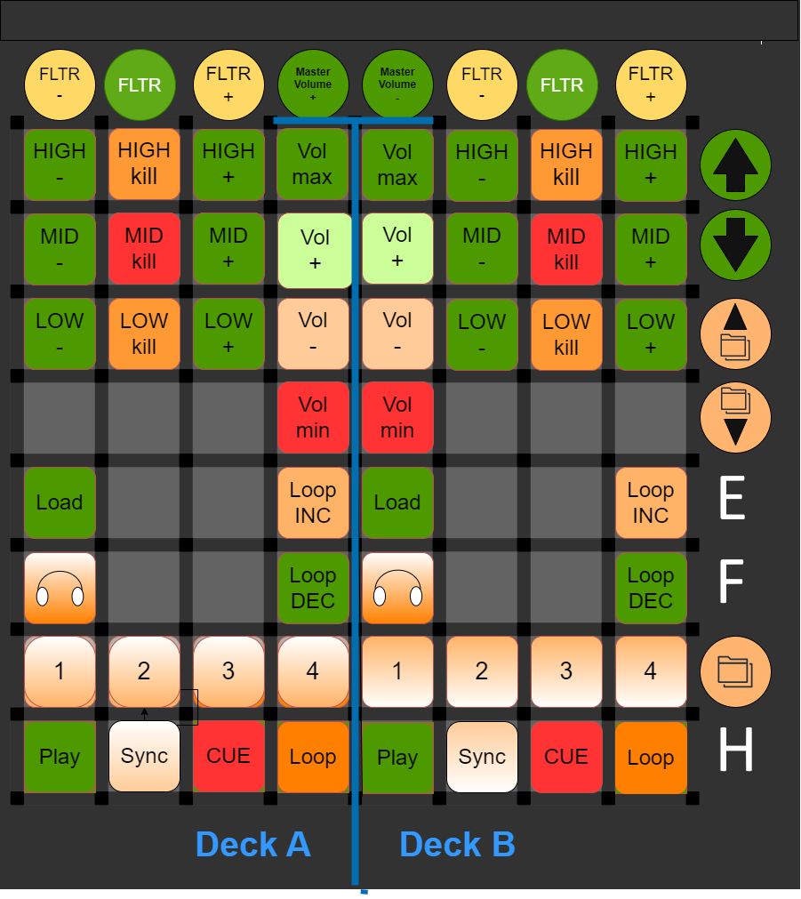

# TraktorPAD

A Traktor Pro controller mapping for the **Novation Launchpad Mini (MK1)** — turns the 8x8 grid into a two-deck battle station: transport, loops, EQ kills, filters, volume and master controls, all with LED feedback.

Forked from [Ryder17z/TraktorPAD](https://github.com/Ryder17z/TraktorPAD) (2016, unmaintained) — this fork adds master volume, monitor cueing, sync and a few quality-of-life mappings, and is now the maintained version.



## Layout



Two decks side by side (A left, B right), color-coded: green = transport/utility, orange = modifiers, red = kills and minimums.

The full, editable diagram lives in [`docs/TraktorPad.drawio`](./docs/TraktorPad.drawio) — open it with [draw.io](https://app.diagrams.net/) if you want to re-arrange things before re-mapping in Traktor.

## What's on the grid

**Top row (per deck):** Filter − / kill / +, with **Master Volume + / −** in the two center columns.

**Per deck (A left, B right):**
- **Volume column:** Vol max / + / − / min (min and max are instant jumps, +/− are incremental, all with LED feedback)
- **EQ:** HIGH / MID / LOW, each with −, KILL and +
- **Load** button, **Monitor (headphones)** button
- **Loop:** size 1–4, Loop INC / DEC
- **Transport:** Play, Sync, CUE, Loop

**Shared tricks:**
- Pressing **PLAY** sets your deck as tempo master; **CUE** hands tempo master to the other deck
- Monitor buttons cue to headphones, with LED state

## Install

1. Download [`mapping/traktorpad.tsi`](./mapping/traktorpad.tsi) (or grab it from the [releases](https://github.com/twicechild/TraktorPAD/releases) page).
2. In Traktor Pro: **Settings → Controller Manager → Add Device → Import** — pick the `.tsi`.
3. Set the Launchpad Mini's MIDI input/output ports on the new *Generic MIDI* device.
4. Play. The grid LEDs should light up immediately — if they don't, check the device ports in step 3.

Tested with Traktor Pro 2 and a Launchpad Mini MK1. The MK2 uses a different MIDI implementation — it will not work out of the box.

## Repo layout

```
mapping/          the .tsi controller mapping (the actual artifact)
docs/             layout diagram (drawio), grid layout image, hardware photo
```

## Credits

- Original mapping: [Ryder17z](https://github.com/Ryder17z/TraktorPAD) (originally [Patrik356b](https://github.com/Patrik356b/TraktorPAD))
- Hardware photo: Novation Launchpad Mini MK1

## License

Boost Software License 1.0 — same as upstream. See [LICENSE.md](./LICENSE.md).