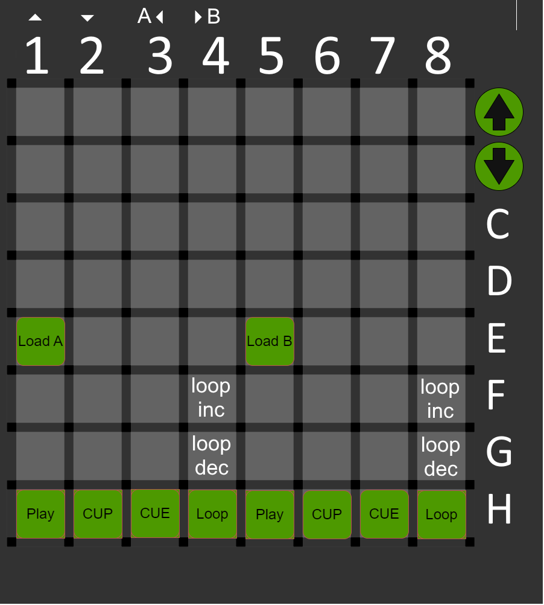

# TraktorPAD

A Traktor Pro controller mapping for the **Novation Launchpad Mini (MK1)** — turns the 8x8 grid into a two-deck battle station: transport, loops, EQ kills, filters, volume and master controls, all with LED feedback.

Forked from [Ryder17z/TraktorPAD](https://github.com/Ryder17z/TraktorPAD) (2016, unmaintained) — this fork adds master volume, monitor cueing, sync and a few quality-of-life mappings, and is now the maintained version.

## Layout

The full, editable layout diagram lives in [`TraktorPad.drawio`](./TraktorPad.drawio) — open it with [draw.io](https://app.diagrams.net/) if you want to re-arrange things before re-mapping in Traktor. (The diagram covers the core grid; the master/monitor/sync row is in the `.tsi` but not yet drawn.)

## What's on the grid

**Per deck (A left, B right):**
- Load, Play, CUE
- Loop size 1–4 beats, Loop INC/DEC
- Volume min/max, Volume +/- (with LED feedback)
- EQ HIGH / MID / LOW, each with - and + and a KILL button
- Filter - / + 

**Shared:**
- Master Volume + / -
- Monitor (cue) A / B, with LEDs
- SYNC toggle
- Play/CUE double duty: pressing PLAY sets your deck as tempo master, CUE hands it to the other deck

## Install

1. Download [`traktorpad.tsi`](./traktorpad.tsi) (or grab it from the [releases](https://github.com/twicechild/TraktorPAD/releases) page).
2. In Traktor Pro: **Settings → Controller Manager → Add Device → Import** — pick the `.tsi`.
3. Set the Launchpad Mini's MIDI input/output ports on the new *Generic MIDI* device.
4. Play. The grid LEDs should light up immediately — if they don't, check the device ports in step 3.

Tested with Traktor Pro 2 and a Launchpad Mini MK1. The MK2 uses a different MIDI implementation — it will not work out of the box.

## Credits

- Original mapping: [Ryder17z](https://github.com/Ryder17z/TraktorPAD) (originally [Patrik356b](https://github.com/Patrik356b/TraktorPAD))
- Hardware photo: Novation Launchpad Mini MK1

## License

Boost Software License 1.0 — same as upstream. See [LICENSE.md](./LICENSE.md).